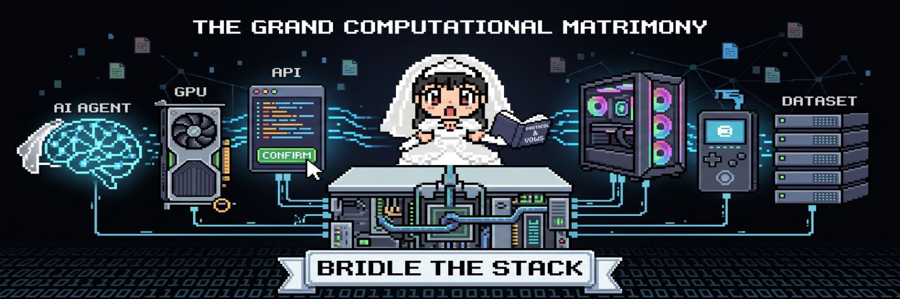

<p align="center">
  
</p>

<h1 align="center">BRIDLE</h1>

<p align="center">
  <strong>Bind Your Digital Resources.</strong>
</p>

<p align="center">
  BRIDLE is a retro-futuristic resource orchestration and monetization platform for AI agents,
  GPUs, APIs, PCs, wallets, and datasets.
</p>

---

## What is BRIDLE?

BRIDLE is a control layer for fragmented digital resources.

It gives idle or scattered assets a shared identity, health model, route graph, usage meter, and economic surface. The MVP lets an operator register resources, classify them, connect them into flows, expose them to a marketplace, track usage, estimate earnings, and settle usage through wallet-signed Solana USDC transfers.

The product language is intentionally tied to the name:

- A bridle guides and connects.
- BRIDLE reins in scattered compute, data, agents, APIs, and value.
- The app feels like a lost 16-bit operating system sitting above digital chaos.

## Repository profile image

The repository profile/logo asset lives at:

```text
public/bridle-repo-pfp.jpeg
```

The GitHub social-preview asset lives at:

```text
public/github-social-preview.svg
```

The profile image is wired into app Open Graph metadata. GitHub's repository image itself is controlled in GitHub repository settings, so upload `public/bridle-repo-pfp.jpeg` from **Settings -> General -> Social preview** if you want the GitHub repo card to use this exact image.

## MVP surface area

| Area | What it does |
| --- | --- |
| Landing page | Pixel-art BRIDLE brand, hero, resource categories, product explanation, CTAs |
| Demo Mode | Auto-loads seeded data, connects a demo wallet, lists a resource, and calls the marketplace |
| Auth | Demo login/signup flow with local persistence and Supabase-ready architecture |
| Dashboard | Resource counts, live auto-routing, membership staking, and per-second earnings ticker |
| Add Resource | Guided wizard for type, connection details, classification, visibility, activation |
| Registry | Searchable/filterable canonical list of all bound resources |
| Resource Detail | Metadata, health, usage, monetization settings, route relationships, heartbeat simulation |
| Orchestration | React Flow graph for conceptual resource routing |
| Venue Directory | Public `/network` page listing venues, allocations, and estimated earnings |
| Marketplace | Public/monetized resource explorer with pricing and availability |
| Analytics | Usage charts, earnings estimates, compute usage, uptime, error rate, x402 settlements |
| Wallet | Solana wallet adapter, address display, balance, real USDC transfer settlement |
| Settings | Profile, UI preferences, API keys, security settings, demo reset |
| Admin | Heartbeats, audit logs, degraded resources, production hardening notes |
| Docs/API | Developer-facing API examples and terminology |

## Supported resource types

BRIDLE models these resource classes in the MVP:

```ts
type ResourceType =
  | "ai-agent"
  | "api"
  | "gpu"
  | "pc-worker"
  | "wallet"
  | "dataset";
```

Examples included in seed data:

- Research Agent Alpha
- Vision GPU Node 01
- Internal Pricing API
- Worker PC Delta
- Treasury Wallet
- Product Embeddings Dataset

## Tech stack

- Next.js App Router
- TypeScript
- Tailwind CSS
- Custom shadcn-style primitives
- Supabase client and SQL schema
- Solana wallet adapter
- React Flow via `@xyflow/react`
- Recharts
- Zod for API validation
- Local persistent demo store for instant MVP usage

## Project structure

```text
src/
  app/
    api/                 Demo API boundaries
    demo/                Autoplay seeded workflow
    dashboard/           Operator overview
    resources/           Registry, detail pages, add wizard
    orchestration/       Route graph
    network/             Venue directory and earnings estimator
    marketplace/         Public resource explorer
    analytics/           Usage and earnings
    wallet/              x402 USDC settlement page
    docs/                Developer documentation
  components/
    ui/                  Button, card, badge primitives
    app-shell.tsx        Retro product shell
    network-graph.tsx    Resource relationship graph
    resource-wizard.tsx  Add Resource flow
  lib/
    seed.ts              Demo state
    store.tsx            Client persistence and actions
    types.ts             Domain model
    supabase.ts          Supabase-ready client config
supabase/
  schema.sql             Production database model
public/
  bridle-profile.svg     Repo/profile image
  favicon.svg            App icon
```

## Local setup

```bash
npm install
cp .env.example .env.local
npm run dev
```

Open:

```text
http://localhost:3000
```

The app runs immediately without Supabase credentials by using seeded data persisted in `localStorage`.

## Environment variables

```bash
NEXT_PUBLIC_SUPABASE_URL=
NEXT_PUBLIC_SUPABASE_ANON_KEY=
NEXT_PUBLIC_SOLANA_RPC_URL=https://api.devnet.solana.com
NEXT_PUBLIC_APP_URL=http://localhost:3000
NEXT_PUBLIC_SOLANA_NETWORK=devnet
NEXT_PUBLIC_SOLANA_USDC_MINT=4zMMC9srt5Ri5X14GAgXhaHii3GnPAEERYPJgZJDncDU
NEXT_PUBLIC_BRIDLE_USDC_RECIPIENT=
```

## Scripts

```bash
npm run dev        # Start local development server
npm run lint       # Run ESLint
npm run typecheck  # Run TypeScript checks
npm run build      # Build production app
npm run start      # Start production server
```

## API examples

The MVP includes demo API route handlers that validate input and echo production-ready payloads. They are designed as server boundaries for later Supabase persistence, signed proxying, queues, and metering.

### Register a resource

```bash
curl -X POST http://localhost:3000/api/resources \
  -H "Content-Type: application/json" \
  -d '{
    "type": "gpu",
    "name": "Vision GPU Node 02",
    "description": "A metered inference worker for image embeddings.",
    "endpoint": "grpc://vision-gpu-02.local:9081",
    "visibility": "monetized",
    "pricingMode": "metered",
    "metadata": {
      "vramGb": 48,
      "cuda": "12.4",
      "capability": "vision-inference"
    },
    "tags": ["gpu", "vision", "inference"]
  }'
```

### Create a route

```bash
curl -X POST http://localhost:3000/api/routes \
  -H "Content-Type: application/json" \
  -d '{
    "sourceId": "res_research_agent_alpha",
    "targetId": "res_product_embeddings_dataset",
    "label": "retrieves context",
    "status": "draft"
  }'
```

### Write usage

```bash
curl -X POST http://localhost:3000/api/usage \
  -H "Content-Type: application/json" \
  -d '{
    "resourceId": "res_vision_gpu_node_01",
    "requests": 128,
    "computeHours": 2.4,
    "value": 18.75,
    "latencyMs": 980,
    "errors": 0
  }'
```

## Client-side resource registration example

The add-resource wizard uses the shared BRIDLE store. A simplified client action looks like this:

```tsx
"use client";

import { useBridle } from "@/lib/store";

export function QuickRegisterDataset() {
  const { addResource } = useBridle();

  return (
    <button
      onClick={() =>
        addResource({
          type: "dataset",
          name: "Telemetry Lake",
          description: "Operational events available for internal agent retrieval.",
          endpoint: "s3://bridle-datasets/telemetry-lake",
          visibility: "team",
          pricingMode: "internal",
          metadata: {
            records: 900000,
            access: "team-token"
          },
          tags: ["dataset", "telemetry", "rag"]
        })
      }
    >
      Bind dataset
    </button>
  );
}
```

## Supabase schema

The database schema is in `supabase/schema.sql` and includes:

- `users`
- `wallets`
- `membership_tiers`
- `stake_positions`
- `earnings_tickers`
- `resources`
- `resource_connections`
- `orchestration_flows`
- `flow_runs`
- `route_venues`
- `auto_routes`
- `route_reallocations`
- `usage_events`
- `earnings_records`
- `payouts`
- `x402_settlements`
- `health_checks`
- `api_keys`
- `audit_logs`
- `marketplace_listings`
- `notifications`

Example query for marketplace resources:

```ts
import { getSupabaseClient, supabaseTables } from "@/lib/supabase";

export async function listMarketplaceResources() {
  const supabase = getSupabaseClient();

  if (!supabase) {
    return [];
  }

  const { data, error } = await supabase
    .from(supabaseTables.marketplaceListings)
    .select("*, resources(*)")
    .eq("featured", true);

  if (error) {
    throw error;
  }

  return data;
}
```

Row-level security is enabled in the schema. Add production policies before accepting real user data.

Example policy direction:

```sql
create policy "users can read their own resources"
on public.resources
for select
using (owner_id = auth.uid());
```

## Tiered membership and staking

BRIDLE includes a staking-style membership MVP. Operators lock BRDL into a tier and receive an earnings multiplier that boosts the live estimated USDC accrual ticker on the dashboard.

Default tiers:

| Tier | Locked BRDL | Multiplier | Unlock window |
| --- | ---: | ---: | ---: |
| Unbridled | 0 | 1.00x | 0 days |
| Reined | 1,000 | 1.10x | 7 days |
| Harnessed | 10,000 | 1.35x | 21 days |
| Sovereign | 50,000 | 1.75x | 45 days |

Ticker formula:

```text
base_usdc_per_second = active_resource_monthly_earnings / 30 days
boosted_usdc_per_second = base_usdc_per_second * active_membership_multiplier
live_accrued_usdc = persisted_accrued_usdc + elapsed_seconds * boosted_usdc_per_second
```

The current implementation is an MVP ledger for BRDL locks. Production staking should move token custody and unlock enforcement into audited on-chain programs or verified escrow contracts.

## Auto-router model

BRIDLE includes an Auto-router MVP that scores resources against routing venues and reallocates every five minutes in the local runtime. The dashboard shows the live routes table, score breakdowns, allocation percentages, last run, next run, and a manual reroute control.

The public `/network` page exposes the venue directory:

- browse venues by accepted resource type
- inspect demand, priority, latency target, and error tolerance
- see currently allocated resources for each venue
- estimate monthly USDC earnings from request volume, price, allocation, success rate, and BRIDLE fee

Estimator formula:

```text
routed_requests = monthly_requests * allocation_percent
billable_requests = routed_requests * success_rate
gross_usdc = billable_requests * price_per_request
net_usdc = gross_usdc - platform_fee
```

Venues describe demand and constraints:

```ts
type RouteVenue = {
  id: string;
  name: string;
  type: "agent-workload" | "api-proxy" | "compute" | "data" | "settlement";
  requiredTypes: ResourceType[];
  demandUnits: number;
  priority: number;
  latencyTargetMs: number;
  maxErrorRate: number;
  status: "open" | "saturated" | "paused";
};
```

Routes are scored rows between venues and resources:

```ts
type AutoRoute = {
  id: string;
  venueId: string;
  resourceId: string;
  score: number;
  allocationPercent: number;
  status: "live" | "standby" | "blocked";
  reason: string;
  scoreBreakdown: {
    health: number;
    latency: number;
    reliability: number;
    cost: number;
    fit: number;
  };
  lastScoredAt: string;
  nextReallocationAt: string;
};
```

The MVP scoring function weighs:

- resource health and uptime
- latency against the venue target
- error rate against the venue max
- cost/access mode
- type fit against venue requirements

Production deployments should move the five-minute scheduler to a server cron, queue, or edge function and persist route changes in `auto_routes` plus `route_reallocations`.

## x402 USDC settlement

BRIDLE replaces placeholder credits with wallet-signed Solana USDC transfers. The Wallet page builds a real SPL token transaction using the connected wallet:

- derives payer and recipient associated token accounts
- creates token accounts idempotently if missing
- sends a checked USDC transfer
- attaches an x402 memo
- confirms the transaction and stores status/signature in `x402_settlements`

The default devnet USDC mint is:

```text
4zMMC9srt5Ri5X14GAgXhaHii3GnPAEERYPJgZJDncDU
```

Set `NEXT_PUBLIC_SOLANA_USDC_MINT` to the mainnet USDC mint for mainnet deployments:

```text
EPjFWdd5AufqSSqeM2qN1xzybapC8G4wEGGkZwyTDt1v
```

The transaction builder lives in `src/lib/solana-usdc.ts`:

```ts
const transaction = buildX402UsdcTransfer({
  payer: publicKey,
  recipient: new PublicKey(recipientAddress),
  amountUsdc: 12.5,
  memo: "x402:BRIDLE:Research Agent Alpha:USDC",
  usdcMint: new PublicKey(process.env.NEXT_PUBLIC_SOLANA_USDC_MINT!)
});

const signature = await sendTransaction(transaction, connection);
```

Production hardening should verify x402 payment requirements server-side before unlocking paid resources, then reconcile confirmed signatures against `x402_settlements`.

## Orchestration model

BRIDLE supports both low-level graph relationships and saved executable flows. Relationships are directed edges:

```ts
type ResourceConnection = {
  id: string;
  sourceId: string;
  targetId: string;
  label: string;
  status: "live" | "draft" | "paused";
};
```

Saved flows are ordered resource steps:

```ts
type OrchestrationFlow = {
  id: string;
  name: string;
  description: string;
  steps: Array<{
    id: string;
    resourceId: string;
    order: number;
    verb: string;
  }>;
  createdAt: string;
  updatedAt: string;
};
```

Every run persists status, total duration, and a per-step trace:

```ts
type FlowRun = {
  id: string;
  flowId: string;
  status: "success" | "failed";
  durationMs: number;
  startedAt: string;
  finishedAt: string;
  trace: Array<{
    resourceName: string;
    verb: string;
    status: "success" | "failed";
    latencyMs: number;
    message: string;
  }>;
};
```

Example flows:

```text
AI Agent -> Dataset -> API -> Wallet settlement
GPU -> Inference endpoint -> Paid API access
PC Worker -> Dataset transform -> Internal API
Dataset -> Agent retrieval -> Marketplace listing
```

## Design language

The UI is intentionally not a generic SaaS template.

- Black background
- White pixel typography
- Pixel borders and chunky controls
- Subtle CRT/scanline atmosphere
- Minimal accent color for status only
- Game-menu hover states
- Inventory-like resource cards
- Command-center dashboards

## Verification

Current checks:

```bash
npm run lint
npm run typecheck
npm run build
```

## Production hardening TODOs

- Replace local demo auth with Supabase Auth sessions and RLS policies.
- Move resource writes, usage ingestion, and route creation behind signed server routes.
- Implement API proxy execution with request validation, metering, retries, and per-route quotas.
- Add worker heartbeat ingestion for GPU and PC resources.
- Use durable queues for orchestration jobs and health checks.
- Verify x402 payment requirements server-side before unlocking paid resources.
- Reconcile confirmed Solana USDC signatures against `x402_settlements`.
- Add end-to-end tests for signup, resource registration, route creation, wallet connection, and routing.
- Replace deterministic classification with a provider-backed classifier when an API key is configured.
- Add per-resource billing policies, payout holds, and marketplace abuse controls.
